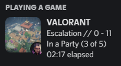
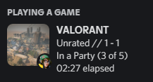

```

██╗   ██╗ █████╗ ██╗      ██████╗ ██████╗  █████╗ ███╗   ██╗████████╗    ██████╗ ██████╗  ██████╗
██║   ██║██╔══██╗██║     ██╔═══██╗██╔══██╗██╔══██╗████╗  ██║╚══██╔══╝    ██╔══██╗██╔══██╗██╔════╝
██║   ██║███████║██║     ██║   ██║██████╔╝███████║██╔██╗ ██║   ██║       ██████╔╝██████╔╝██║     
╚██╗ ██╔╝██╔══██║██║     ██║   ██║██╔══██╗██╔══██║██║╚██╗██║   ██║       ██╔══██╗██╔═══╝ ██║     
 ╚████╔╝ ██║  ██║███████╗╚██████╔╝██║  ██║██║  ██║██║ ╚████║   ██║       ██║  ██║██║     ╚██████╗
  ╚═══╝  ╚═╝  ╚═╝╚══════╝ ╚═════╝ ╚═╝  ╚═╝╚═╝  ╚═╝╚═╝  ╚═══╝   ╚═╝       ╚═╝  ╚═╝╚═╝      ╚═════╝
                                                                                                        
```

  <ol>  
    <li><a href="#about">Acerca</li>
    <li><a href="#usage">Uso</a></li>
    <li><a href="#disclaimer">Aviso Legal</a></li>
  </ol>
 
 
## About


 Valorant RPC (Rich Presence) te permite mostrar detalles del juego como la puntuación actual en tu perfil de Discord. Otras funciones son mostrar el mapa actual, el agente, el estado de inactividad, etc.

 
 <a>
    
    

 </a>

 
 
## Installation

 - Descarga la última [actualización](https://github.com/korahx365/valrpc/releases/latest/download/valrpc.exe) and run it.

 
 
## Usage

 - Iniciar el programa en lugar de abrir VALORANT
     - Si VALORANT no se está ejecutando, el programa lo iniciará por usted.
 - Si VALORANT ya se está ejecutando, ejecute el programa y se iniciará la presencia.


 
## Disclaimer 

 Este proyecto no está afiliado a Riot Games ni a ninguno de sus empleados y, por tanto, no refleja las opiniones de dichas partes.
 
 Riot Games no respalda ni patrocina este proyecto. Riot Games y todas las propiedades asociadas son marcas comerciales o marcas registradas de Riot Games, Inc.

 Este proyecto utiliza además la API creada por Collin Hartigan. Web: https://colinhartigan.github.io/


